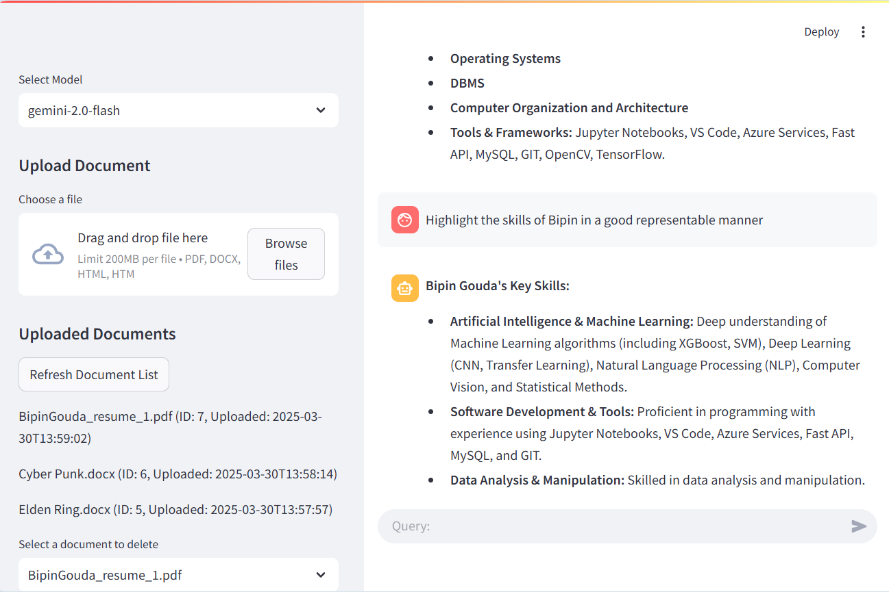

# Conversational RAG App

## 🚀 Overview

This project is a **Conversational Retrieval-Augmented Generation (RAG) system** with chat history retention. It integrates various technologies to provide intelligent and context-aware responses.

## 🏗️ Tech Stack

- **Frontend:** Streamlit
- **Backend:** Flask
- **LLM API:** Google Gemini API
- **Vector Database:** ChromaDB
- **Session & Chat Storage:** SQLite3
- **Debugging & Tracing:** Langsmith

## ✨ Features

- **Conversational AI with Memory:** Maintains chat history for better context retention.
- **Google Gemini API Integration:** Provides intelligent, context-aware responses.
- **ChromaDB for Vector Storage:** Efficiently stores and retrieves embeddings.
- **SQLite3 for Persistent Chat Storage:** Manages session IDs and conversation logs.
- **Langsmith for Debugging & Optimization:** Helps trace application flow and performance.

## 🛠️ Setup Instructions

### 1️⃣ Clone the Repository

```sh
git clone https://github.com/Bipin-Gouda/Conversational_RAG_APP.git
cd Conversational_RAG_APP
```

### 2️⃣ Create a Virtual Environment & Install Dependencies

```sh
pip install -r requirements.txt
```

### 3️⃣ Set Up Environment Variables

Create a `.env` file and add your API keys:

```
GEMINI_API_KEY=your_google_gemini_api_key
```

### 4️⃣ Start the Flask Backend

```sh
cd api
python -m uvicorn main:app --reload
```

### 5️⃣ Start the Streamlit Frontend

In a new terminal:

```sh
cd app
streamlit run app.py
```

## 🧑‍💻 Usage

- Open the **Streamlit UI** in your browser.
- You can upload your documents in the sidebar upload section
- Start chatting with the AI, and it will retain conversation history for a better experience.
- The system will use ChromaDB for efficient information retrieval.

## 🔍 Debugging & Monitoring

- Langsmith is integrated for tracing requests, helping debug issues efficiently.
- Logs are stored in the database for analysis.

## 🤝 Contributing

Feel free to submit issues and pull requests to improve the project!

SS of the Working Application

